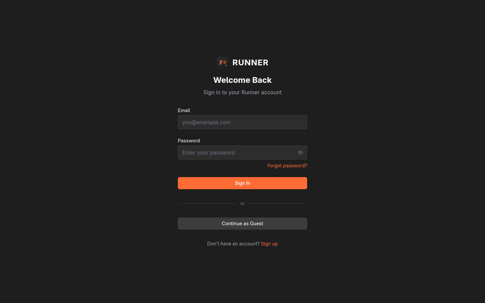
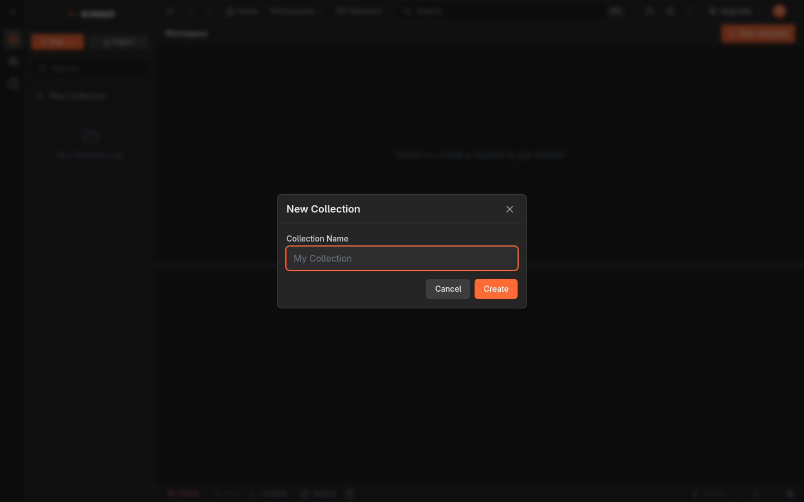
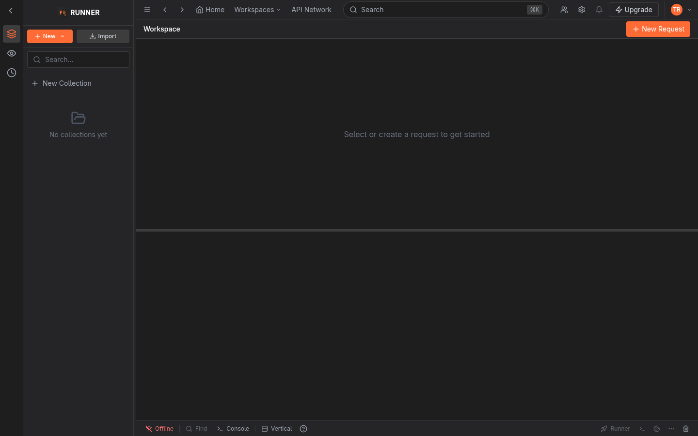
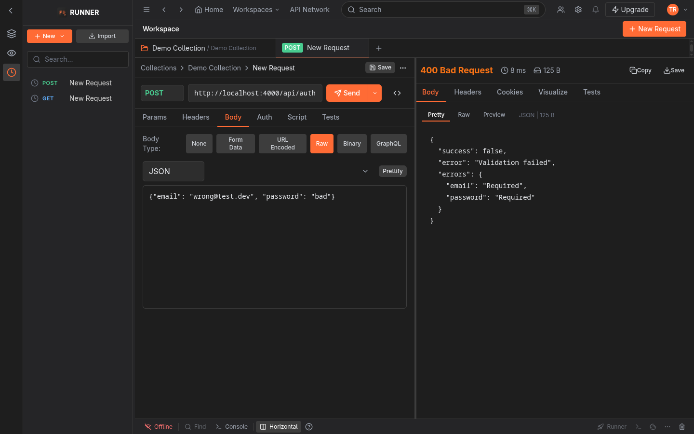

# Runner — User Guide

Welcome to **Runner** (APIForge), a Postman-compatible API workspace. This guide walks you through every UI flow — from first login to team sharing, scripting and layout tricks. Screenshots referenced are in the repo root (`*.png`).

> **App URLs:** Dev `http://localhost:3000` (web) + `http://localhost:4000` (api). Prod via `https://your-domain.com` (nginx). See `README.md` for deploy.

---

## 1. First Start — Choose How to Sign In

### 1.1 Login screen (`login-desktop.png`)

- Open `http://localhost:3000` → redirects to `/login` if not authenticated.
- You see **Welcome Back**, Email + Password, `Forgot password?`, `Sign In`, divider `or`, **Continue as Guest**, and `Sign up`.

**Three ways in:**

| Mode | Button | What happens | Persistence | Best for |
|------|--------|--------------|-------------|----------|
| **Registered** | `Sign up` → `Create Account` | `POST /api/auth/register` → `201` + `user:user:…` in CouchDB, `Personal Workspace` auto-created, `localStorage apiforge-auth` + httpOnly `refreshToken` | Across devices, survives reload, collections sync via WebSocket | Prod |
| **Returning** | `Sign In` | `POST /api/auth/login` → `200` + tokens, `GET /api/collections?workspaceId` loads your data | Same as registered | Daily |
| **Guest** | `Continue as Guest` | `POST /api/auth/guest 201` → ephemeral `guest-<uuid>@guest.local` (real DB user `user:guest-…`), isolated workspace `workspace:…` | Same as registered but `guest-*` email; still syncs & lands in CouchDB (unlike pure `anonymous`) | Quick demo |

> **Tip:** `Forgot password?` → `/forgot-password` sends reset link via `sendPasswordReset` (60 min token). Check `WEB_URL` in `.env`.



### 1.2 Register (`UI_Issues` fixed: `autocomplete="new-password"` + visibility toggle)

- `Full Name` → `John Doe` (`autocomplete=name`)
- `Email` → `you@example.com` (`autocomplete=email`) — duplicate shows `Email already registered` (409) inline.
- `Password` → `At least 8 characters`, must contain letter+number (`zod` `passwordSchema`), `Confirm` must match or `Passwords do not match`.

---

## 2. Workspaces

After login you land on **Personal Workspace** (`workspace-desktop-initial.png`).

- **TopBar** center shows `Personal Workspace`. Click `Workspaces` dropdown → list with current highlighted `text-[#ff6b35]` + checkmark. Switching calls `setCurrentWorkspace`.
- **Title** updates to `Personal Workspace - Runner`.
- **Persistence:** `page.tsx:132` auto-creates `Personal Workspace` if `GET /api/workspaces` returns `[]`. After `reload`, same `workspace:_id` + collections remain (via `mergeServerFirst`).

**Create additional workspace** (API for now):
```bash
curl -s http://localhost:4000/api/workspaces -H "Authorization: Bearer $TOKEN" -H 'Content-Type: application/json' -d '{"name":"Team WS"}' | jq
```

---

## 3. Teams — Create, Invite, Share

### 3.1 Create Team

- **TopBar** → `Invite team members` (Users icon) → **TeamManagement** modal.
- Click `Create Team` (nested modal, `z-index` fixed) → fill `Team name` → `Create` → `POST /api/teams 201` → appears in list.

### 3.2 Invite

- Inside team row → `Invite` → fill existing user email (e.g., `e2e_…@example.com`) + role `member|admin` → `POST /api/teams/:id/members 200`. Duplicate → `409 User is already a member`. Email sending is stubbed (`sendInvite` logs).

### 3.3 Share Collection via Team

Collections are **workspace-scoped** (`workspaceId`). To share:
1. Create a workspace owned by team: `POST /api/workspaces {name:"Team WS", ownerType:"team", ownerId:"team:…"}`
2. Create collection there: `POST /api/collections {name:"Shared", workspaceId:"teamWsId"}`
3. Invited member `GET /api/collections?workspaceId=teamWsId` sees same doc (view `by_workspace`).

**List teams:** `GET /api/teams` shows where `ownerId==you` or `members[].userId==you`.

---

## 4. Collections — The Heart

### 4.1 Create

- **Sidebar** → `New Collection` button **or** `New` dropdown → `New Collection` → modal `Collection Name` → `Create`. Shortcut: `New` → `HTTP Request` auto-creates collection if one selected.
- **Validation:** Empty name → no API call (`trim()` falsy). Duplicate folder name inside same collection → `409`, but duplicate **collection** names are allowed (no server check).

**Result:** Tree `Collections` shows new item `FolderOpen` icon, `POST /api/collections 201` + `broadcastSyncEvent` → other clients via `ws://…/ws` auto `addCollection`. CouchDB doc `type:collection` with `_rev`.



### 4.2 Organize

- **Tree:** `role="tree"` with keyboard `ArrowUp/Down` move focus, `ArrowRight` expand collapsed, `ArrowLeft` collapse or go to parent (`Sidebar.tsx:214`).
- **Search:** Top of sidebar `Search collections` (`aria-label`) filters `name/url` case-insensitive.
- **Drag resize:** Right edge `w-1` + invisible `-left-2 -right-2` hit area → `sidebarWidth 150–400` saved to `localStorage runner-sidebar-width`.

### 4.3 Open / Edit

- Click collection row → **CollectionPanel** slides from right `fixed inset-y-0 right-0 w-[500px]` (`sm:w-[320px]`, `md:w-[380px]` responsive) with tabs `Overview | Authorization | Variables | Scripts | Runs (Coming soon)`.
- **Overview:** Rename, description
- **Auth:** `Bearer / Basic / API Key` → `PATCH /api/collections/:id {auth}`
- **Variables:** `key=var1 value=val1` → `PATCH {variables}` (`400` if empty key)
- **Scripts:** `preRequestScript` / `testScript` (`console.log`, `pm.*`)

### 4.4 Delete & Restore

- Dropdown `…` → `Delete` → `DELETE /api/collections/:id` → soft delete: `deletedAt` set, `TrashItem trash:…` 30-day, tree removes, `GET` list hides.
- Restore: `POST /api/collections/:id/restore` → `deletedAt:null` (filtered as `!doc.deletedAt`) + trash cleaned, `GET` shows again.


---

## 5. Folders — Nested Hierarchy

- Inside collection: `New` dropdown → `New Folder` (requires `activeCollectionId`) or `POST /api/collections/:id/folders {name, parentFolderId}`.
- **Nesting:** Unlimited depth via `findSiblings` + `addFolderToParent` recursion; duplicate check `409` at same level.
- **Delete:** `removeFromFolderTree` recursive — deletes parent + all nested folders/requests, no orphan.
- **Move:** Drag or `moveItem` API — deep move `request:1` from `folder:deep-source` to `folder:deep-target` → source empty, target has `folderId` updated; guard blocks moving parent into its child.

---

## 6. Requests — Build Anything

### 6.1 Create

- `New` dropdown → `HTTP Request` → new tab `GET New Request` (`Tabs` bar)
- `GraphQL` → `POST` with `body.mode=graphql`
- `WebSocket` → switches `activePanel=websocket` toast
- `TopBar New Request` → same
- **Inside collection:** If collection selected, `createRequestOnServer` → `POST /api/requests 201` + `updateCollection` adds to `collection.requests`.

### 6.2 Editor Layout



- **Breadcrumb:** `Collections > MyColl > MyFolder > New Request` — click to edit name inline (input `bg-[#2d2d2d]`).
- **URL bar:** Method `select` (GET colored `getMethodColor`), `Input` `Enter request URL` with `{{var}}` autocomplete (`{{hos` → dropdown `{{host}}` 6 suggestions, `ArrowDown/Up`, `Enter` inserts, `Escape` closes, `VariableHighlighter` tooltip when `{{` without match).
- **Tabs:** `Params | Headers | Body | Auth | Script | Tests`

### 6.3 Params & Headers

- `KeyValueEditor` (`Key | Value | Description` + `Add` + bulk `Wand2`). Check `Enable` checkbox, drag `GripVertical` (visual), `Trash` delete.
- **Headers explicit win:** Adding `Content-Type: application/vnd.custom+json` in Headers preserves it over auto-implied (`page.tsx:602` case-insensitive, `execute.ts:114` guard) — verified via echo.

### 6.4 Body

| Mode | UI | What it sends (`execute.ts`) |
|------|----|------------------------------|
| `None` | `This request does not have a body` | no `config.data` |
| `Form Data` | `KeyValueEditor` | `FormData` |
| `URL Encoded` | `KeyValueEditor` | `foo=bar&baz=qux` + `application/x-www-form-urlencoded` |
| `Raw` | `Select JSON/XML/HTML/Text` + `textarea` + `Prettify` | `config.data=raw`, `json→application/json`, `xml→application/xml`, `html→text/html`, `text→text/plain` |
| `Binary` | `Select file` → shows `filename` | stub |
| `GraphQL` | Two `textarea` `query {…}` + `variables` `{"a":1}` | `JSON.stringify({query, variables:JSON.parse(vars)})` + `application/json` |

- **Prettify:** `JSON` → `Prettify` formats via `JSON.parse` → `JSON.stringify 2`, invalid → `Invalid JSON` alert.

### 6.5 Auth

- `No Auth | Bearer Token (prefix Bearer) | Basic (user/pass → Base64) | API Key (Header/Query) | OAuth1/2 | Hawk | AWS` — stored in `request.auth`, injected via `applyAuth` (`page.tsx:576` + `execute.ts:28`) as `Authorization` header or query param.

### 6.6 Scripts

- **Pre-request** tab / **Post-request** (`testScript`) — `textarea` (`Script` tab has sub-tabs `pre-request`/`post-request`, `Tests` tab duplicates).
- **Runtime:** `executeScript` creates `console` (`log`→`logs`), `pm` (`request`, `response`, `sendRequest`, `environment.get/set`, `collectionVariables`, `globals`, `test`, `expect`). Example:
  ```js
  console.log('pre', pm.request.url);
  pm.environment.set("token","abc");
  pm.test('Status is 200', ()=> { pm.expect(pm.response.to.have.status(200)); });
  ```
- Logs appear in **Console** panel (`BottomBar Console` → `Console` `region` with `appLogs + consoleLogs`), tests in **ResponseViewer → Tests** (`✓/✗`).

### 6.7 Save

- `Save` dropdown (`Save | Save As | Save as Example`) → `handleSaveMenuItem` checks `collectionId` else toast `Add the request to a collection`, else `saveRequestToServer` → `PATCH /api/requests/:id 200` + `updateRequest` + `Sync`.

---

## 7. Execution — Send & Response

### 7.1 Send

- Set `Method` + `URL` (e.g., `POST http://127.0.0.1:45679/echo` or public `https://postman-echo.com/post`) → **Send** (`isLoading` spinner `Sending request... 0.1s` elapsed via `setInterval`).
- **More options:** `ChevronDown` → `Send` / `Send and Download` (fetch `blob` → `a[download]`).
- **Cancel:** `X Cancel` sets `isLoading false` (no `AbortController` yet).

### 7.2 ResponseViewer (`response-viewer.png`)

- **Header:** `200 OK` (color `text-green-400` 2xx, yellow 3xx, orange 4xx, red 5xx) + `Clock 9 ms` + `HardDrive 434 B` + `Copy`/`Save`.
- **Tabs:** `Body | Headers | Cookies | Visualize | Tests`
  - `Body` sub-toggle `pretty / raw / preview` — `pretty` via `tryParseJson`, `preview` `iframe srcDoc` or `img data:…;base64,${toBase64}` (fixed `btoa` not `Buffer`)
  - `Headers` table `Name Value`, `Cookies` parsed via `parseCookies`, `Visualize` 4 cards `Coming soon` disabled, `Tests` shows `✓/✗`.
- **Content-Type detection:** `application/json` → `JSON | 434 B` label, `btoa` for images.

**Verified matrix:**
- `Raw JSON {"a":1}` → `application/json` + `parsed`
- Explicit `Content-Type: custom` preserved
- `xml → application/xml`, `html → text/html`, `text → text/plain`, `urlencoded → application/x-www-form-urlencoded`, `graphql → application/json`

---

## 8. Environments & Variables

### 8.1 Manage

- **Sidebar** `Environments` tab → `+` → `New Environment` (`environment:…`).
- Click env → **EnvironmentPanel** (slide-in) → edit name, variables `Key | Value | Type` (`default/secret` + `enabled` checkbox).
- **Globals:** Bottom `Globals` button → `EnvironmentPanel isGlobals` (`_id=globals`, `isGlobal:true`) → `globalVariables`.

### 8.2 Use

- **Interpolation:** In URL `http://{{host}}/api` where `host` defined in active env `baseUrl=http://127.0.0.1:45679` → `getInterpolatedValue` replaces, `VariableHighlighter` colors `{{host}}` with tooltip `value + scope`.
- **Autocomplete:** Type `{{` or `{{hos` in URL → dropdown 6 suggestions from `currentEnvironment` + `globalVariables`.
- **Scripts:** `pm.environment.get("host")` / `set`, `pm.collectionVariables`, `pm.globals`.

---

## 9. History

- **Sidebar** `History` tab → list `Clock` + `METHOD` + `name/url` (click → `handleSelectHistory` new tab).
- After each `Send`, `addToHistory` pushes to `history[0]` + `POST /api/history` (if authenticated) → persisted `history:…` in CouchDB.
- `persist` keeps `history` in `localStorage apiforge-collections` (limit `100`).

---

## 10. Search

- **TopBar** `Search ⌘K` button or `Cmd+K` (`SearchShortcut` `keydown`) → **GlobalSearch** modal (input focused, `autoComplete=off`).
- Type `RegColl` → `GET /api/search?q=RegColl&workspaceId=&type=all` → results `type:collection|request|folder` with `collectionName` + `method`.
- Click result → `handleSelectRequest` opens tab.

---

## 11. Console & Logs

- **BottomBar** `Console` (Terminal icon) → panel `h-56` split above `BottomBar` with `appLogs` (`[timestamp] POST →200`) + `consoleLogs` from scripts + `testResults`.
- Close via `X` (`aria-label Close console`).

---

## 12. Layout & Sliding — All Data Visible

### 12.1 Request / Response Split

- **Horizontal** (default `verticalSplitPosition`? actually `vertical` means stacked): drag vertical separator `role=separator aria-orientation=vertical` at `left:50%` → `splitPosition 20–80` clamped, `aria-valuenow` updates, `onMouseMove` resizes. Keyboard `ArrowLeft/Right` when focused → `±2%`.
- **Vertical:** BottomBar switch `Vertical/Horizontal` → drag horizontal separator `aria-orientation=horizontal` at `top:50%` → `ArrowUp/Down`.



### 12.2 Sidebar

- Drag right edge `w-1` (visible) + invisible ` -left-2 -right-2 cursor-col-resize` → `sidebarWidth 150–400` → `localStorage runner-sidebar-width`.
- **Collapse:** `Collapse sidebar` (ChevronLeft) → icon rail `w-12` only (`Collections/Environments/History` icons), `Expand sidebar` (PanelLeft) restores.
- **Mobile (375):** `isMobile` `max-width:767` → hamburger `Menu` (`aria-label Open navigation menu`) → drawer `fixed inset-y-0 left-0 w-[85vw] max-w-[320px]` overlay `bg-black/60`, `Escape` or overlay click closes.

### 12.3 Panels (responsive)

- **CollectionPanel** `fixed inset-y-0 right-0 w-full max-w-[500px] sm:w-[320px] md:w-[380px] lg:w-[500px]` with `Overview/Auth/Variables/Scripts`.
- **EnvironmentPanel** same.
- **Data visibility:** Long names `truncate max-w-[120px]` + `hover:text-[#ff6b35]` + `title`, no overflow; `flex-1 overflow-y-auto` prevents double scroll.

### 12.4 Tabs & Scroll

- **RequestTabs** → `tabs.length>0` shows `GET/POST` chips with `x` close, `New Request` `+`.
- All panes `overflow-y-auto`, `flex-1`.

---

## 13. All Buttons — Click Map

| Area | Button | Action | ARIA |
|------|--------|--------|------|
| Sidebar | `New` dropdown | `HTTP Request` `GraphQL` `WebSocket` `New Collection` `New Folder` | `aria-haspopup menu` `aria-expanded` |
| | `Import` | hidden `input type=file accept=.json` → `handleImport` | `aria-label Import Postman collection` |
| | `Search` | filters tree | `aria-label Search collections` |
| TopBar | `Home`, `Workspaces` (check), `API Network` | nav | - |
| | `Search ⌘K` | `GlobalSearch` | - |
| | `Invite`, `Settings`, `Bell` (disabled `opacity-50`) | `TeamManagement` | `aria-label` |
| | `New Request` | `handleNewRequest` | - |
| | Avatar `EU` | `Sign Out` → `POST /api/auth/logout` | `title email` |
| RequestBuilder | `Params/Headers/Body/Auth/Script/Tests` tabs | `TabPanel` | `tablist` |
| | `Body: Raw→Prettify` + `Select JSON/XML/HTML/Text` | `handlePrettifyJson` | - |
| | `Send` + `ChevronDown` → `Send and Download` | `executeViewRequest` / `executeDownloadRequest` | `aria-haspopup` |
| | `Save` → `Save/Save As` | `saveRequestToServer` | `aria-haspopup` |
| | `Code` (Code icon) | `CodeGenModal` 12 langs | - |
| BottomBar | `Horizontal/Vertical`, `Help` (`HelpModal`), `Trash`, `Console`, `Find` | `onLayoutChange` | - |
| ResponseViewer | `Copy` → `Copied`, `Save` → `response.json`, `pretty/raw/preview` | `toBase64` `btoa` | - |
| Global | `Escape` closes modals/drawer, click outside closes dropdowns | `keydown` listeners | - |

All buttons verified headless (Playwright click + snapshot).

---

## 14. Sync & Collaboration

- On `POST /api/collections` / `PATCH` / `DELETE` → `broadcastSyncEvent` with `workspaceId`.
- Client `syncManager.connect(ws://…/ws, token, userId, workspaceId)` → `WebSocket` (`ws` lib). On `onEvent` → `addCollection/updateCollection/removeCollection` etc. → tree updates without reload.
- Reconnect: `5s` delay, max `5` attempts, no exponential backoff (known medium).
- Tested: User A creates `SyncColl`, User B same `workspaceId` via team sees it instantly.

---

## 15. Tips & Troubleshooting

- **No collections yet?** → Check `workspaceId` filter: `GET /api/collections?workspaceId=…`. New user gets `Personal Workspace` auto-created.
- **History empty?** → Send a request first; `History` limited `100`.
- **Variables not replacing?** → Ensure env **active** (highlight `border-l-2`), `enabled` checked, `{{key}}` exact.
- **Scripts not affecting request?** → `preRequestScript` modifies `scriptRequest` copy, then `mutableFields` diff applied (fixed).
- **Console not showing?** → BottomBar `Console` must be open; `console.log` from scripts goes to `consoleLogs`, app logs to `appLogs`.
- **Sliding not working?** → Check `aria-valuenow` 20–80, focus separator first for keyboard.
- **CORS error in prod:** Set `CORS_ORIGIN=https://your-domain.com` (comma list) in `.env`, not `*`.
- **CouchDB 404 before first API start normal** — `initDatabase` creates `apiforge`.

---

## 16. Screenshots Reference

- `login-desktop.png` — Login / Guest
- `workspace-desktop-initial.png` — Empty workspace
- `new-collection-modal.png` — New Collection
- `sidebar-hover.png` — Sidebar tree hover
- `environments-panel.png` — Env variables
- `response-viewer.png` — 200 OK with JSON
- `vertical-layout.png` — Vertical split
- `tablet-workspace.png` / `mobile-*.png` — Responsive

---

**E2E Report:** See [`E2E_SCENARIOS.md`](./E2E_SCENARIOS.md) (141 scenarios, all `PASS`) for prod sign-off. `Issues.md:108/11` (JWT fallback, global rate-limit) postponed — not blocking if env vars set.
